# See Cmux Solve 3 Multi-Agent Orchestration Problems

> **1. One orchestrator agent** 
>
> **2. A whole window of terminals and agent teams.**
>
> **3. Full programmatic control.**
> 
> A hands-on showcase for anyone running Agentic Coding Agents at scale on macOS.

📺 Watch this video to get the full breakdown of this codebase: **[See Cmux Solve Multi-Agent Orchestration With IndyDevDan on YouTube](https://youtu.be/WAFUMBLOjHo)**

<p align="center">
  
</p>

[cmux](https://cmux.com) is a native macOS terminal, built on Ghostty, for running many AI coding agents at once. This repo is **31 natural-language prompts** that prove a single thesis: a primary agent (Claude Code, pi, Codex, Gemini) can stand up, prompt, observe, and tear down a whole **fleet** of other agents and terminals inside cmux, entirely through cmux's CLI and socket. **Prompts 1–25** climb from "open one workspace" to "run an autonomous, browser-verified, multi-window software factory"; **prompts 26–31** cover **customizing** cmux (color-coding, theming, custom actions, layouts, sidebars, and per-pane identity). Every one was executed or schema-validated against cmux `0.64.17` before it landed here.

> **Start with the visual guide.** Run `just guide` (or open [`guide/index.html`](guide/index.html)) for the single-page walkthrough: the three proofs, the mental model, the four-verb control loop, and all 31 prompts with copy buttons. Everything below is the same study in long form.

---

## The Problem — Three Things I Need From a Fleet Terminal

I run **3-tier agent teams** (leads and workers), and a normal terminal fights me at every turn. Before betting on cmux I needed it to clear three bars. **It clears all three**, and the prompts in this repo are the proof.

1. **Agentic access to every terminal window.** One primary agent must be able to *see and script every surface* in the window: type into it, read it back, close it. Not an SDK abstraction over hidden processes, but real, addressable terminals (`surface:3`) the orchestrator drives directly. Why this matters so much comes later, but it is the whole foundation. → **Tiers 1–5**.
2. **Customizable UI panes so I can tell leads from workers at a glance.** A 3-tier team is unreadable if every pane looks identical. I need per-workspace color, role pill, and icon, plus per-pane identity (tab name, a colored banner, a colored prompt) so a lead never gets mistaken for a worker. → **prompts [26](prompts/26-color-code-and-label.md) + [31](prompts/31-identify-individual-panes.md)**.
3. **Reusable session files that boot new teams at the speed of agents.** Standing up a fresh team should be one declarative file, not ten minutes of clicking. Layouts-as-code spin up the whole roster instantly, and the fleet survives a restart. → **prompts [09](prompts/09-declarative-boot.md) + [24](prompts/24-crash-proof-resume-the-fleet.md)**.

> *Each proof maps to a feature you can see in the visual guide (`just guide`) and run from [`prompts/`](prompts/).*

---

## Install

<p align="center">
  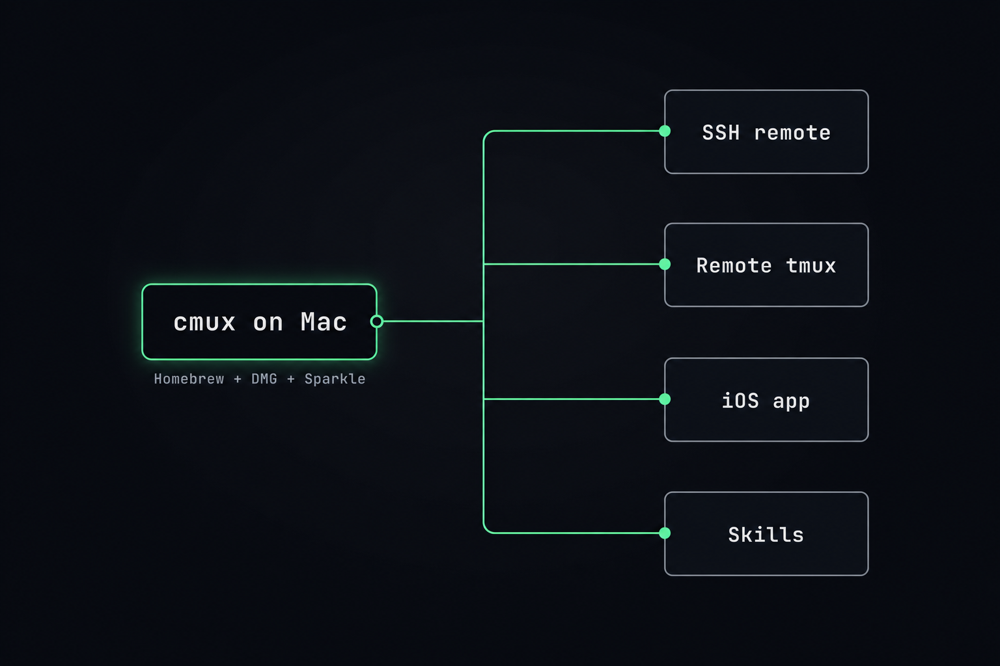
</p>

### Agentic Install

```bash
brew tap manaflow-ai/cmux && brew install --cask cmux   # the native macOS terminal
npx skills add manaflow-ai/cmux -g -y                    # teach your agent the cmux verbs (SKILL.md files)
```

Then run **`just guide`** to open the visual walkthrough, or start an agent in a cmux workspace (`claude`, `pi`, `codex`, `gemini`) and paste any file from [`prompts/`](prompts/). The agent reads the cmux skills, compiles your plain English into `cmux` commands, and drives the fleet.

### Manual Install

**Prereqs:** macOS 14+ (Sonoma), [`Homebrew`](https://brew.sh), and at least one agent CLI ([`claude`](https://claude.com/claude-code), [`pi`](https://github.com/badlogic/pi-mono), [`codex`](https://github.com/openai/codex), `gemini`).

```bash
brew tap manaflow-ai/cmux
brew install --cask cmux
sudo ln -sf "/Applications/cmux.app/Contents/Resources/bin/cmux" /usr/local/bin/cmux   # use `cmux` outside cmux too
cp .env.example .env               # then fill in OPENROUTER_API_KEY / ANTHROPIC_API_KEY / etc.
open -a cmux                       # launch it
```

Inside any cmux terminal the `cmux` command already works. To let an agent drive the socket from **outside** cmux, raise `automation.socketControlMode` (see [Setup & gotchas](#setup--gotchas)).

This repo ships a [`justfile`](justfile) with the everyday commands:

```bash
just guide          # serve + open the single-page visual guide at localhost:8080/guide/
just flotion        # boot the Flotion demo app (FastAPI :8000 + Vite :5173)
just devcc          # Claude Code orchestrator builds a 5-agent team live (/spawn-fs-team)
just devpi          # pi orchestrator does the same
just fastcc <feat>  # scripted fast path: boot all 5 panes from a layout, then attach
```

---

## The Visual Guide

<p align="center">
  
</p>

The centerpiece of this repo is one self-contained page: [`guide/index.html`](guide/index.html). Run **`just guide`** and it opens in your browser with no build step. It is the fastest map of everything here:

- **The three proofs** cmux had to clear, each paired with the feature that clears it.
- **The mental model** (Window → Workspace → Pane → Surface → Panel) and the four-verb **control loop**.
- **All 31 prompts**, grouped by tier, each with a **copy button** so you can hand one straight to your orchestrator.
- **cmux vs tmux vs Warp**: where the parity is, where the real moat is, and the newness tax.

Everything in the rest of this README is the long-form version of what that page shows at a glance.

---

## What This Proves

<p align="center">
  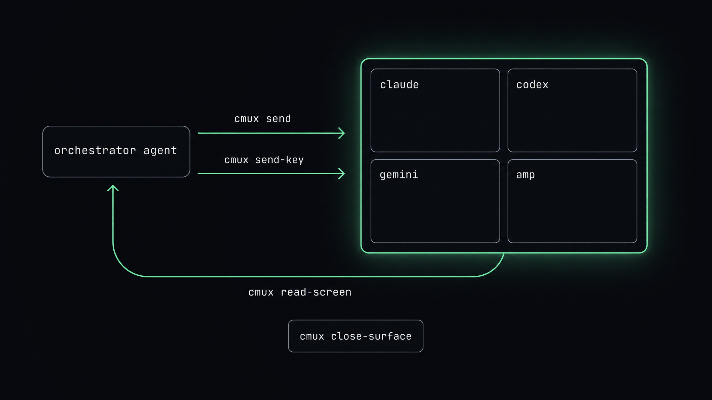
</p>

Most "multi-agent" tooling hides the agents behind an SDK. cmux does the opposite: every agent is a **real terminal surface** you can see, and every surface is **addressable** (`surface:3`) and **scriptable**. So orchestration collapses to four verbs an agent already understands:

```bash
cmux send        --surface surface:3 "claude"     # type into a terminal
cmux send-key    --surface surface:3 enter        # press a key
cmux read-screen --surface surface:3              # read what it printed
cmux close-surface --surface surface:3            # shut it down
```

That is the entire control loop. Wrap it in a workspace, fan it across four panes, and **one agent is now operating four others**. The prompts in this repo were validated end-to-end: a Claude Code agent and a pi agent were launched *inside cmux panes* and driven to real answers over exactly these verbs. **The orchestrator never touched a keyboard.**

---

## The Mental Model

<p align="center">
  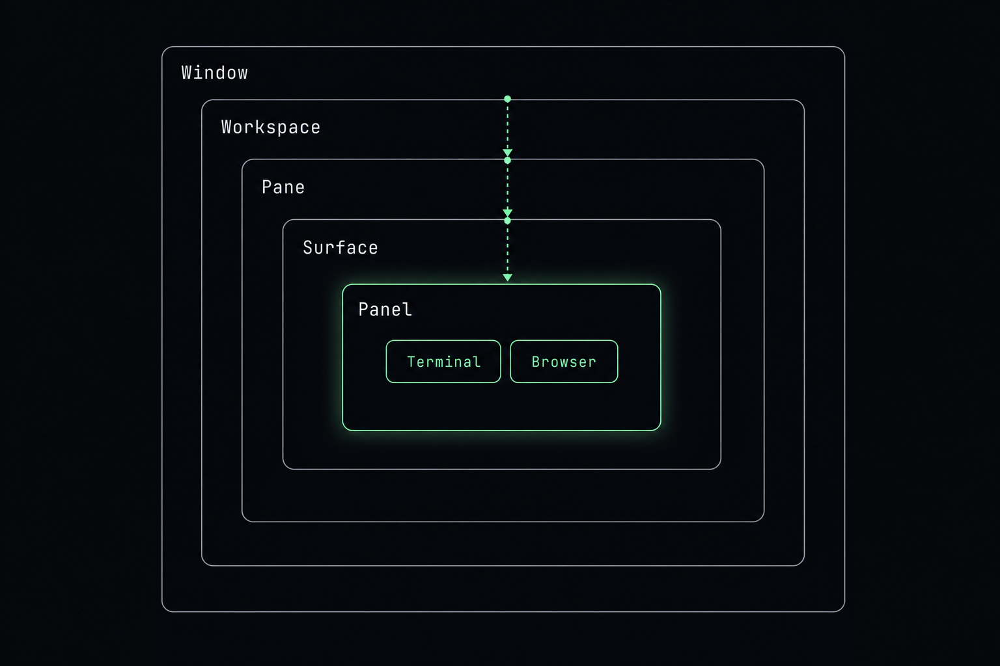
</p>

Everything in cmux nests in one hierarchy. Learn the five boxes and the verbs fall out of them.

```
Window      a macOS window with its own sidebar        ⌘⇧N   cmux new-window
 └ Workspace  a sidebar entry (a "tab")                ⌘N    cmux workspace create
   └ Pane       a split region within a workspace       ⌘D    cmux new-split <dir>
     └ Surface    a tab within a pane (terminal OR browser)  ⌘T  cmux new-surface
       └ Panel      the content itself, created automatically
```

The verbs every prompt is built from (the legacy `new-workspace`/`close-workspace` aliases still work):

| Action | Command | Socket method |
|---|---|---|
| Create a workspace | `cmux workspace create --name X --json` | `workspace.create` |
| Inject credentials | `cmux workspace create --env-file .env` | `workspace.create` |
| Split a pane | `cmux new-split right --surface <ref> --json` | `surface.split` |
| Add a browser surface | `cmux new-pane --type browser --url <url>` | `pane.create` |
| **Type text** | `cmux send --surface <ref> "text"` | `surface.send_text` |
| **Press a key** | `cmux send-key --surface <ref> enter` | `surface.send_key` |
| **Read output** | `cmux read-screen --surface <ref> --scrollback` | `surface.read_text` |
| Push status / progress | `cmux set-status … ` · `cmux set-progress …` | `surface.action` |
| React to the fleet | `cmux events --name agent.hook` | `events.stream` |
| Notify on completion | `cmux notify --title … --body …` | `notification.create` |
| Close / teardown | `cmux close-surface` · `cmux workspace close` | `surface.close` |

> *Refs (`workspace:2`, `surface:3`) are handles you capture at creation and thread through every later call. `--json` gives you them machine-readable; `CMUX_QUIET=1` silences the alias notices for clean scripting.*

---

## Reading, Deciding & Getting Notified

<p align="center">
  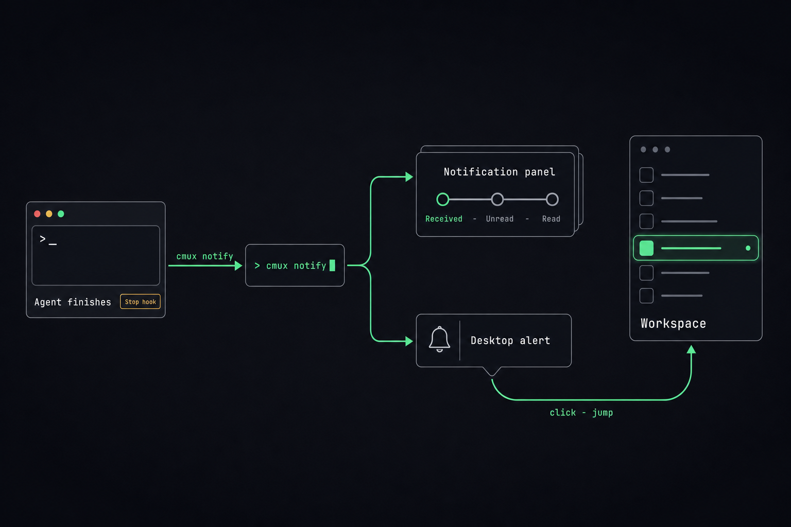
</p>

An orchestrator does two things a script doesn't: it **reads what an agent said and decides**, and it **finds out the moment something happens**. cmux pushes you the discrete events; you only poll the free-form content you actually have to inspect.

| To know… | Use | Push or poll |
|---|---|---|
| an agent finished / needs input | `cmux events --name agent.hook --name notification.created` | **push** |
| block until task X signals done | `cmux wait-for X`  ⇄  `cmux wait-for -S X` | **push** (blocks) |
| any notification, durably | `cmux events --category notification --reconnect --cursor-file …` | **push** |
| what the agent actually wrote | `cmux read-screen --surface <ref> --scrollback` | poll |

```bash
# READ TO DECIDE: make the agent print a sentinel, grep it, branch on it.
cmux send --surface "$S" 'pytest -q && echo VERDICT=GREEN || echo VERDICT=RED'; cmux send-key --surface "$S" enter
V=$(cmux read-screen --surface "$S" --scrollback --lines 200 | grep -oE 'VERDICT=(GREEN|RED)' | tail -1)

# GET PUSHED: subscribe once; cmux streams one line per event (the "doorbell").
cmux events --name agent.hook --name notification.created --reconnect | while read -r e; do
  cmux read-screen --surface "$(jq -r .surface_id <<<"$e")" --scrollback --lines 40   # then read the details
done

# BLOCK ON A RENDEZVOUS: orchestrator waits, worker signals.
cmux wait-for migration --timeout 600    # ⇄  worker runs:  cmux wait-for -S migration
```

Full runnable cookbook (5 patterns plus a reactive dispatcher, all verified live): **[`prompts/PATTERNS-read-and-notify.md`](prompts/PATTERNS-read-and-notify.md)**.

> *The event payload is a privacy-respecting doorbell: it carries `workspace_id` / `surface_id` / `notification_id` and content lengths, but the title and body are redacted. Fetch the text with `cmux list-notifications` or by reading the surface.*

---

## Tier 1 — Foundations

<p align="center">
  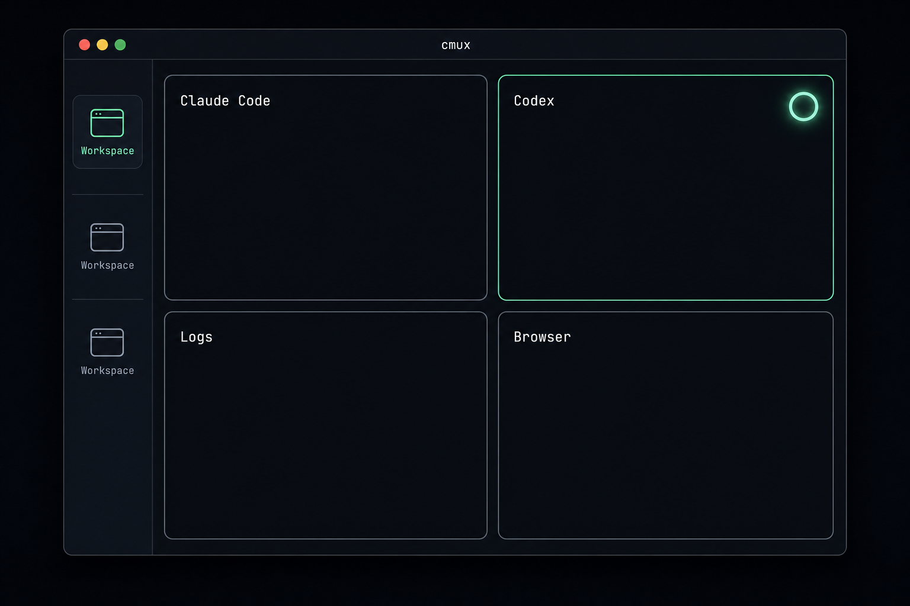
</p>

The atomic loop: create a surface, type into it, read it back, tear it down. No agents yet, just the orchestrator and terminals.

| # | Prompt | What it does | Key verbs |
|---|---|---|---|
| [01](prompts/01-hello-workspace.md) | **Hello, Workspace** | Open a workspace, run a command, read the result back. | `workspace create` · `send` · `read-screen` |
| [02](prompts/02-read-it-back.md) | **Read It Back** | Pull output that scrolled off-screen out of scrollback. | `read-screen --scrollback --lines` |
| [03](prompts/03-split-into-a-grid.md) | **Split Into a Grid** | Turn one workspace into a live 2×2 of terminals. | `new-split <dir> --surface` |
| [04](prompts/04-map-the-world.md) | **Map the World** | Dump the full window/workspace/pane/surface tree + per-surface CPU/mem. | `identify` · `tree --all` · `top` |
| [05](prompts/05-tidy-up.md) | **Tidy Up** | Rename, flash for attention, close panes, then the workspace. | `rename-workspace` · `trigger-flash` · `close-surface` |

---

## Tier 2 — Driving One Agent

<p align="center">
  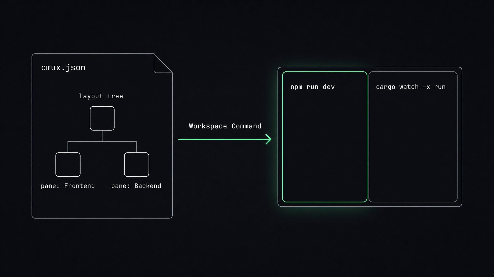
</p>

The pivot: the terminal an agent drives can itself contain **another agent**. This is the whole idea, in miniature.

| # | Prompt | What it does | Key verbs |
|---|---|---|---|
| [06](prompts/06-launch-one-agent.md) | **Launch One Agent** | Boot Claude Code in a pane and prompt it. | `new-pane` · `send` · `read-screen` |
| [07](prompts/07-keys-and-credentials.md) | **Keys & Credentials** | Inject `.env` so an agent comes up authenticated, without leaking secrets. | `workspace create --env-file` · `workspace env --mask` |
| [08](prompts/08-two-agents-one-question.md) | **Two Agents, One Question** | Claude Code + pi side by side, same prompt, compared. | `new-split` · broadcast `send` |
| [09](prompts/09-declarative-boot.md) | **Declarative Boot** | A reusable agent layout as code (`cmux.json` or `--layout`). | `commands[]` · `workspace create --layout` |
| [10](prompts/10-native-sessions-and-resume.md) | **Native Sessions & Resume** | Spawn a provider-aware agent surface that resumes after restart. | `new-surface --provider` · `surface resume` |

---

## Tier 3 — Orchestrating a Fleet

<p align="center">
  
</p>

One orchestrator, many agents. Broadcast, shard, watch, react, and tear down at scale.

| # | Prompt | What it does | Key verbs |
|---|---|---|---|
| [11](prompts/11-the-2x2-fleet.md) | **The 2×2 Fleet** ⭐ | Four agents (Claude, Codex, Gemini, pi), one broadcast task, read all four. | `new-split`×3 · `send` · `read-screen` |
| [12](prompts/12-fan-out-fan-in.md) | **Fan-Out / Fan-In** | Shard a job across agents, then merge their outputs. | per-surface `send` · aggregate |
| [13](prompts/13-live-status-board.md) | **Live Status Board** | Colored status pills + progress bars + logs, one per agent. | `set-status --color` · `set-progress` · `log` |
| [14](prompts/14-reactive-loop.md) | **Reactive Loop** | Drive off cmux's event stream instead of polling screens. | `events --name agent.hook --cursor-file` |
| [15](prompts/15-race-and-notify.md) | **Race & Notify** | Race three agents; the first to finish pings you, the rest are stopped. | `notify` · `jump-to-unread` · `close-surface` |
| [16](prompts/16-scale-and-teardown.md) | **Scale & Teardown** | Rank by CPU, prune stragglers, reassign their work, reclaim the panes. | `top --format tsv` · `close-surface` |

---

## Tier 4 — Terminals Meet the Browser

<p align="center">
  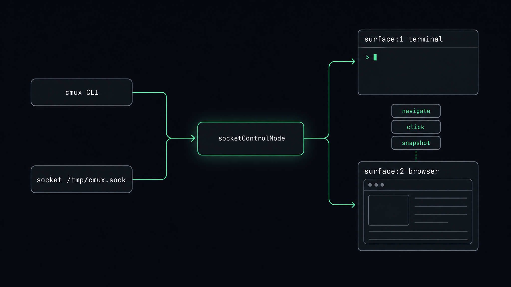
</p>

A cmux surface can be a **browser**, with a Playwright-style API. Now agents build, run, *and verify* in one window.

| # | Prompt | What it does | Key verbs |
|---|---|---|---|
| [17](prompts/17-agent-and-live-preview.md) | **Agent + Live Preview** | A coding agent on the left, a live preview of its app on the right. | `new-pane --type browser` · `browser reload` |
| [18](prompts/18-agent-drives-the-browser.md) | **Agent Drives the Browser** | Snapshot the DOM, click, fill, screenshot to prove it worked. | `browser snapshot/click/screenshot` |
| [19](prompts/19-self-verifying-agent.md) | **Self-Verifying Agent** | Read the browser console/errors, fix, re-check until clean. | `browser console list` · `browser errors list` |
| [20](prompts/20-capture-and-replay-auth.md) | **Capture & Replay Auth** | Log in once, save the session, replay it across every agent run. | `browser state save` · `browser state load` |

---

## Tier 5 — Scale, Remote & Resilience

<p align="center">
  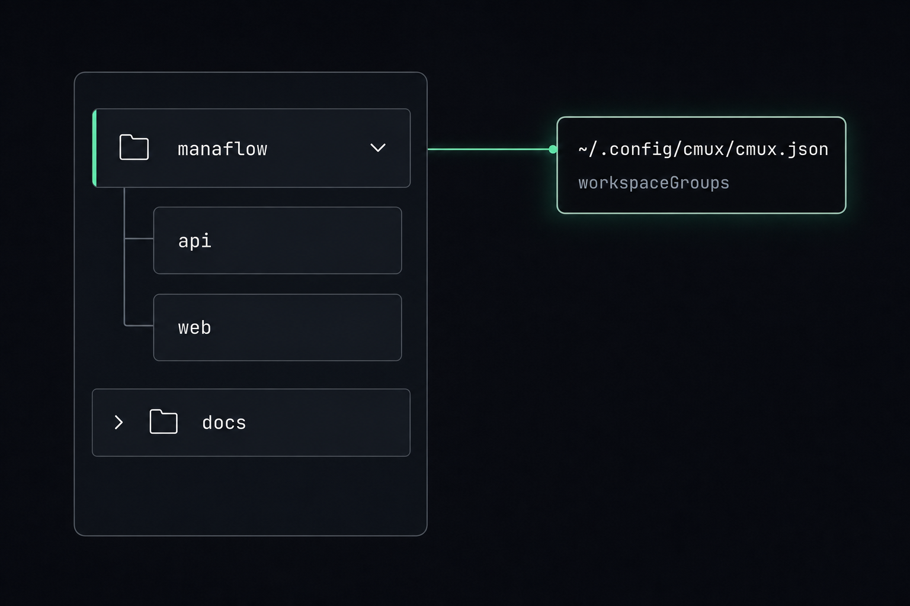
</p>

The largest moves: multiple windows, organized groups, remote and cloud agents, restart survival, and the capstone.

| # | Prompt | What it does | Key verbs |
|---|---|---|---|
| [21](prompts/21-multi-window-command-center.md) | **Multi-Window Command Center** | Spread fleets across macOS windows, route work per window. | `new-window` · `move-workspace-to-window` |
| [22](prompts/22-organized-sidebar-at-scale.md) | **Organized Sidebar at Scale** | Twenty agents kept legible in named, colored, collapsible groups. | `workspace-group create/new-workspace/set-color` |
| [23](prompts/23-remote-and-cloud-fleets.md) | **Remote & Cloud Fleets** | Agents on SSH hosts and cloud VMs, driven by the same verbs as local. | `cmux ssh` · `cmux vm new/ssh/exec` |
| [24](prompts/24-crash-proof-resume-the-fleet.md) | **Crash-Proof: Resume the Fleet** | Quit and relaunch; the layout rebuilds and agents resume their sessions. | `hooks setup` · `restore-session` |
| [25](prompts/25-the-software-factory.md) | **The Software Factory** ⭐ | Plan → fan out → test → browser-verify → notify → collect diffs → teardown. | _all of the above_ |

---

## Customization (26–31)

<p align="center">
  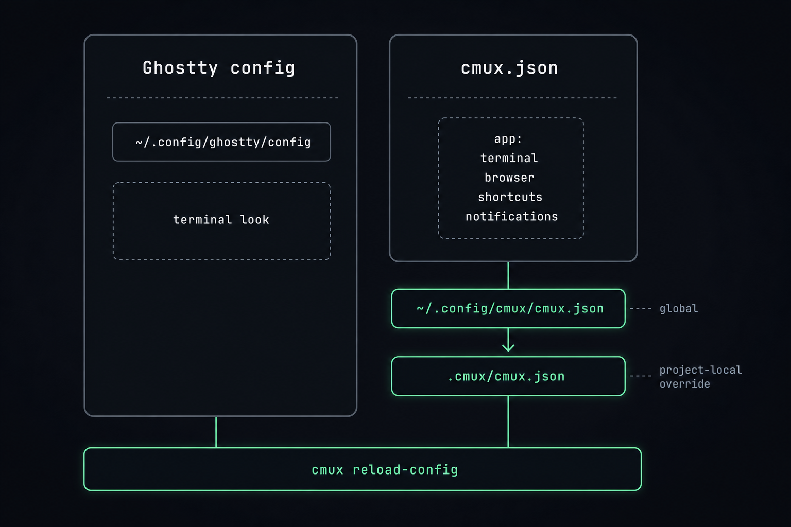
</p>

Customization is **layered and ad-hoc**: per-workspace identity is scriptable on the fly, the terminal's look is a live-reloaded global, and the app's actions/layouts/sidebar are yours to redefine, globally or per-repo via `.cmux/cmux.json`.

| # | Prompt | What it does | Scope |
|---|---|---|---|
| [26](prompts/26-color-code-and-label.md) | **Color-Code & Label the Fleet** | Per-workspace color, role pill, icon, and name — set live from a script. | **per-workspace** (ad-hoc) |
| [27](prompts/27-theme-and-feel.md) | **Theme & Feel** | Font, theme, opacity, cursor via Ghostty config; live-reload, no restart. | global look |
| [28](prompts/28-custom-actions-and-buttons.md) | **Custom Actions & Buttons** | Your own verbs in the Command Palette, tab bar, and **+** button. | app UX |
| [29](prompts/29-layouts-and-dock-controls.md) | **Reusable Layouts & Dock Controls** | Named `commands` layouts + a right-sidebar Dock of tools. | layouts + dock |
| [30](prompts/30-project-config-and-custom-sidebar.md) | **Make It Yours** | Per-repo `.cmux/cmux.json` + a hot-reloading custom sidebar bound to live data. | per-project + sidebar |
| [31](prompts/31-identify-individual-panes.md) | **Identify Individual Panes** | Per-pane identity: tab name + colored ANSI banner + colored prompt. | **per-pane** |

**Ad-hoc, different per workspace?** Yes: color, name, description, status pill, icon, progress, and layout are all per-workspace and scriptable at runtime (prompt 26). **Per-pane terminal *theme*?** No: font/theme/opacity are a single global Ghostty config (prompt 27). You differentiate workspaces by color/label (26), and **panes by tab name + a printed banner/prompt** (prompt 31), not by running two terminal themes side by side.

---

## The Prebuilt cmux Skills

<p align="center">
  
</p>

All 19 skills published in [`manaflow-ai/cmux`](https://github.com/manaflow-ai/cmux) are vendored into [`ai_docs/cmux-skills/`](ai_docs/cmux-skills/) so you can read them. Each folder holds a `SKILL.md` plus `references/`, and several ship `templates/` or `scripts/`. They split in two.

**Agent-facing: teach an agent to *drive* cmux** (this is what `npx skills add manaflow-ai/cmux` installs):

| Skill | What it does |
|---|---|
| [`cmux`](ai_docs/cmux-skills/cmux/SKILL.md) | Core topology + routing: windows, workspaces, panes, surfaces, focus, move, reorder, identify, flash. |
| [`cmux-workspace`](ai_docs/cmux-skills/cmux-workspace/SKILL.md) | Work inside the **current** workspace/surface; caller-aware, non-interfering automation. |
| [`cmux-browser`](ai_docs/cmux-skills/cmux-browser/SKILL.md) | Browser automation: open, click, fill, wait, snapshot, extract (+ auth/session/proxy/video refs & templates). |
| [`cmux-markdown`](ai_docs/cmux-skills/cmux-markdown/SKILL.md) | Open markdown in a live-reloading viewer panel beside the terminal. |
| [`cmux-customization`](ai_docs/cmux-skills/cmux-customization/SKILL.md) | Edit `cmux.json`: actions, custom commands, workspace layouts, palette, dock, tab-bar buttons. |
| [`cmux-settings`](ai_docs/cmux-skills/cmux-settings/SKILL.md) | View / edit / validate `cmux.json` by JSON path (+ all-keys and shortcut-action references). |
| [`cmux-keyboard-shortcuts`](ai_docs/cmux-skills/cmux-keyboard-shortcuts/SKILL.md) | Customize, rebind, audit shortcuts (tmux / Vim / iTerm-style templates). |
| [`cmux-custom-sidebar`](ai_docs/cmux-skills/cmux-custom-sidebar/SKILL.md) | Build a custom sidebar (workspaces / PRs / clock / files) from plain language. |
| [`cmux-diagnostics`](ai_docs/cmux-skills/cmux-diagnostics/SKILL.md) | End-user health check: hooks, notifications, restore, socket, resume (ships a diagnostics script). |

**Contributor: work *on* the cmux codebase** (vendored for completeness; not needed to run the prompts):

| Skill | What it does |
|---|---|
| [`cmux-architecture`](ai_docs/cmux-skills/cmux-architecture/SKILL.md) | Swift package layering, dependency inversion, Swift 6 concurrency rules. |
| [`cmux-backend`](ai_docs/cmux-skills/cmux-backend/SKILL.md) | Backend TypeScript + Cloud VM dev (web/app/api, providers, Postgres, migrations). |
| [`cmux-socket-policy`](ai_docs/cmux-skills/cmux-socket-policy/SKILL.md) | Threading + focus policy for adding socket / CLI commands. |
| [`cmux-shared-behavior`](ai_docs/cmux-skills/cmux-shared-behavior/SKILL.md) | Keep behavior consistent across shortcut / palette / menu / CLI entrypoints. |
| [`cmux-debugging`](ai_docs/cmux-skills/cmux-debugging/SKILL.md) | Debug logging, runtime pitfalls, typing-latency-sensitive paths. |
| [`cmux-testing`](ai_docs/cmux-skills/cmux-testing/SKILL.md) | Swift Testing rules + local-vs-CI validation. |
| [`cmux-dev-workflow`](ai_docs/cmux-skills/cmux-dev-workflow/SKILL.md) | Repo setup, Xcode normalization, tagged sidebar-extension builds. |
| [`cmux-ghostty`](ai_docs/cmux-skills/cmux-ghostty/SKILL.md) | Ghostty submodule / GhosttyKit.xcframework workflow. |
| [`cmux-localization`](ai_docs/cmux-skills/cmux-localization/SKILL.md) | UI-string localization rules + audit workflow. |
| [`cmux-release`](ai_docs/cmux-skills/cmux-release/SKILL.md) | Release workflow: version bump, changelog, tags, assets. |

The nine agent-facing skills are the ones that power these prompts. Install them globally with `npx skills add manaflow-ai/cmux -g -y`.

---

## How This Was Tested

Every prompt's command choreography was run against a live cmux before shipping. Two real coding agents were launched **inside cmux panes** and driven to real output.

<p align="center">
  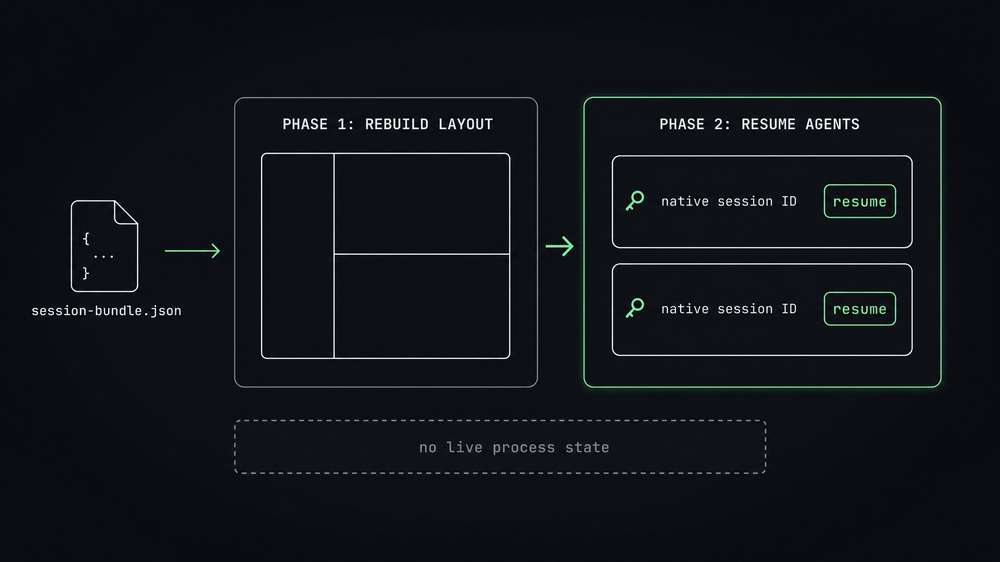
</p>

| Layer | Check | Result |
|---|---|---|
| Install | `brew install --cask cmux` → `cmux 0.64.17` on `PATH` | **✓** |
| Mechanics | All 25 fleet prompts' verb sequences executed + cleaned up (26–30 are config-based) | **✓** |
| Topology | `workspace create` / `new-split` / `tree` / `list-panes` | **✓** |
| Drive loop | `send` → `send-key enter` → `read-screen` round-trips | **✓** |
| Credentials | `--env-file` injects keys; a pane inherits `OPENROUTER_API_KEY` | **✓** |
| **Claude Code** | `claude -p` in a pane returned **PONG**; interactive TUI also booted | **✓** |
| **pi** | `pi -p --provider openrouter` in a pane returned **PONG** | **✓** |
| Dashboards | `set-status` / `set-progress` / `log` / `notify` | **✓** |
| Events | `cmux events` streamed `surface.created` / `agent.hook` / `notification.created` | **✓** |
| Browser | open → `wait` → `snapshot` → `screenshot` (54 KB) → `state save` | **✓** |
| Groups | `workspace-group create` → `new-workspace` → `set-color` / `set-icon` | **✓** |

> *Both agents answered over nothing but `cmux send` / `cmux read-screen`. The thesis holds with real models.*

---

## Setup & Gotchas

<p align="center">
  
</p>

The honest edges, all of which the prompts account for:

- **The orchestrator must reach the socket.** `automation.socketControlMode` defaults to `cmuxOnly`, which means an agent driving cmux must itself run **inside a cmux terminal**. To drive it from an outside script, raise the mode in `~/.config/cmux/cmux.json` and `cmux reload-config`:
  ```jsonc
  { "automation": { "socketControlMode": "allowAll" } }   // or "password" + socketPassword
  ```
- **`send` types, `send-key` submits.** `cmux send` does not press Enter. Submit with `cmux send-key <ref> enter` (or end the text with `\n`, which `send` treats as Enter).
- **No modifier chords.** `send-key` sends single named keys (`enter`, `tab`, `escape`, arrows). There is no `Ctrl-C`. To stop a running agent, `cmux close-surface` it.
- **Capture refs at creation.** `cmux workspace create --json` returns `workspace_ref` + the initial `surface_ref`; `new-split --json` returns the new `surface_ref`. Grab and thread them; don't guess.
- **The real socket path** is `~/.local/state/cmux/cmux.sock` (override with `CMUX_SOCKET_PATH`). It is a local Unix socket, not a network port.
- **Don't inject a placeholder key over a working login.** If your agent is already logged in (e.g. Claude Code), don't `--env-file` a bogus `ANTHROPIC_API_KEY` over it. Scope `.env` injection to the agents that need it.
- **Sandboxed agents.** The Tier-1 demo prompts use a `mktemp -d /tmp/…` working dir and temp files (never `$HOME`, `/usr/bin`, or `/var/log`), so they run even when the agent has no home or bin-dir access. Point any prompt's `--cwd` at a directory your agent is allowed to write.

The two config files: Ghostty owns terminal rendering (`~/.config/ghostty/config`); cmux owns the app (`~/.config/cmux/cmux.json`, plus a project-local `.cmux/cmux.json`). Both reload live with `cmux reload-config` (no restart).

## Folder Structure

```
cmux-capabilities-guide/
├── guide/                        # ⭐ the centerpiece — run `just guide` to open it
│   ├── index.html                #   one self-contained page: proofs, model, control loop, 31 prompts w/ copy buttons
│   ├── cmux-guide.pdf            #   the same guide, paginated for offline / print
│   └── images/                   #   themed section diagrams + the hero SVG
├── prompts/                      # the 31 prompts in long form (25 fleet + 6 customization)
│   ├── 01-hello-workspace.md     #   Tier 1 — foundations (01–05)
│   ├── …                         #   Tiers 2–5 — one agent · fleet · browser · scale (06–25)
│   ├── 26-color-code-and-label.md#   Customization — identity, theme, actions, layouts, sidebar (26–31)
│   └── PATTERNS-read-and-notify.md  # read-to-decide + push/notify cookbook
├── ai_docs/
│   └── cmux-skills/              # all 19 prebuilt cmux skills, vendored for inspection
├── apps/flotion/                 # the demo app the agent team builds (Vue 3 + TS / FastAPI + SQLite)
├── cmux/fs-team.layout.json      # declarative layout that boots a 5-agent team in one call
├── scripts/spawn_fast.py         # uv single-file script behind `just fastcc` / `just fastpi`
├── images/                       # the diagrams reused as README section art
├── .claude/                      # /prime, /spawn-fs-team, the 5 agent roles, and the cmux skill
├── justfile                      # `just guide` · `just flotion` · `just devcc` · `just fastcc`
├── .env.example                  # provider API keys an orchestrator injects to kick off sub-agents
└── README.md                     # you are here
```

Each prompt file is self-contained: the **plain-English prompt** you hand your orchestrator, an **answer-key** of the exact `cmux` verbs it should compile to, and **success criteria** you can check.

---

## License

MIT — see [`LICENSE`](LICENSE).

---

## Master Agentic Coding

Prepare for the future of software engineering.

Learn tactical agentic coding patterns with [Tactical Agentic Coding](https://agenticengineer.com/tactical-agentic-coding?y=cmux-caps).

Follow the [IndyDevDan YouTube channel](https://www.youtube.com/@indydevdan) to improve your agentic coding advantage.

---

Stay Focused and Keep Building

- IndyDevDan
